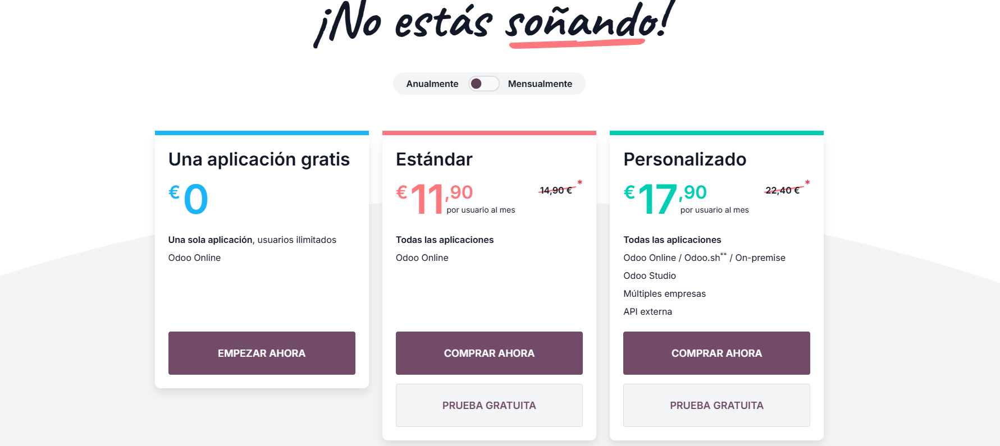
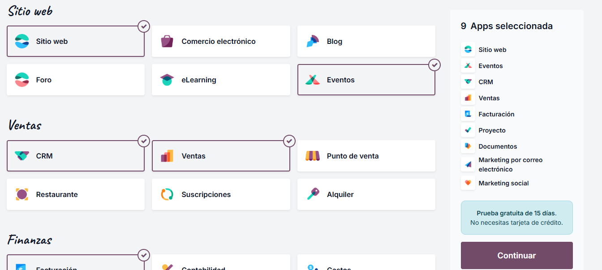
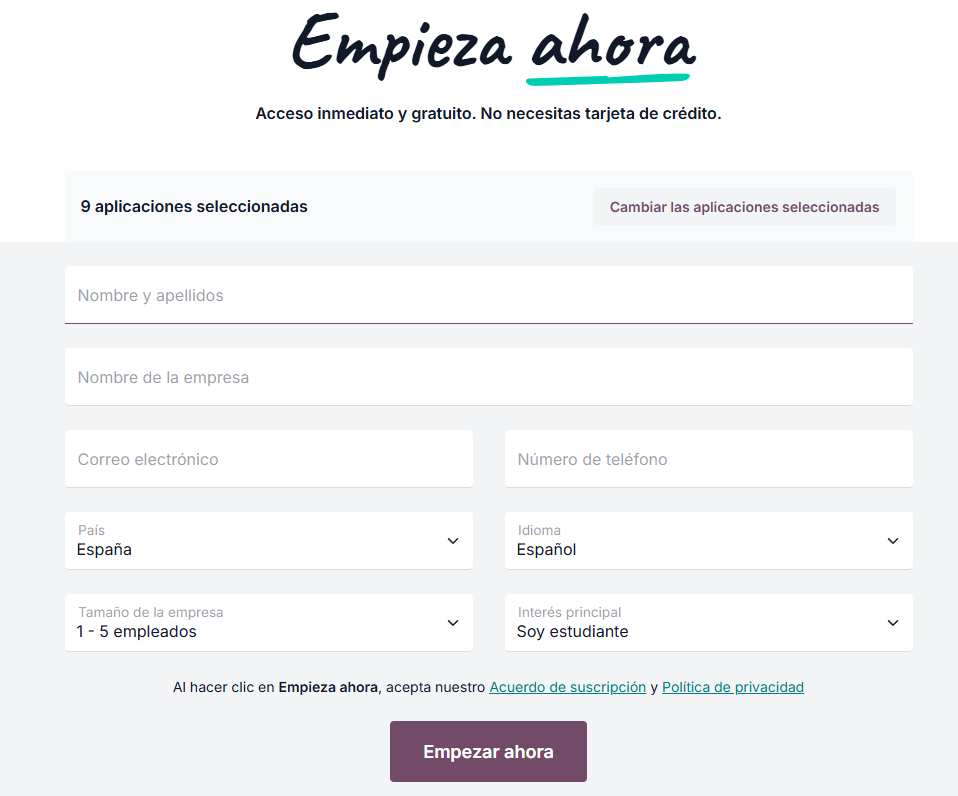
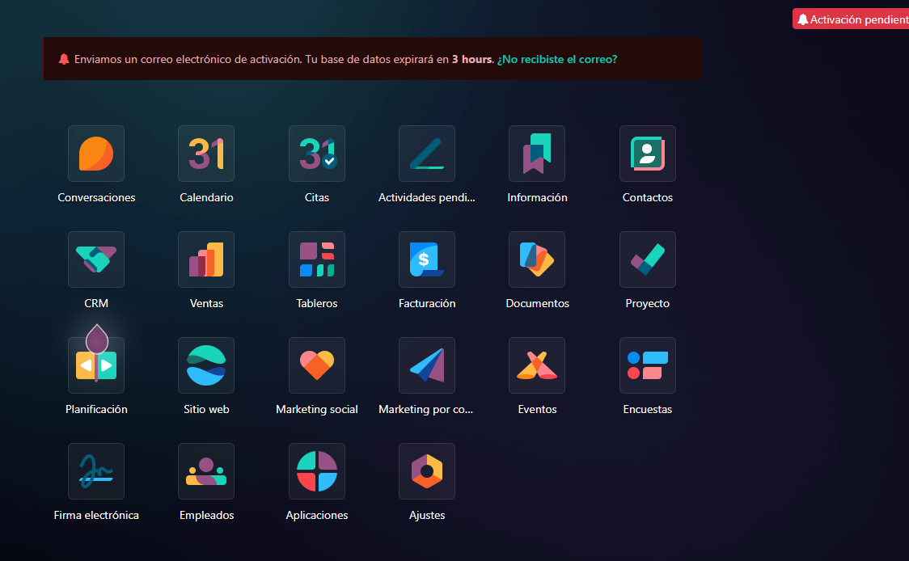
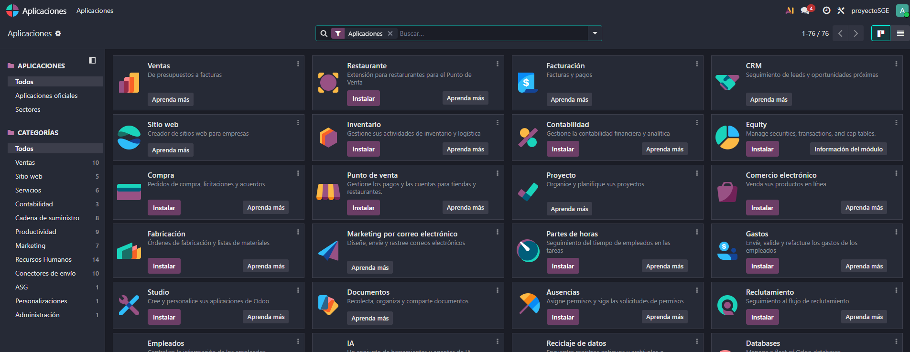
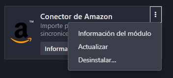

# 03 — Instalación y prueba (15 días) / Alta e instalación de apps

> Estructura orientativa

## Requisitos previos

- Navegador actualizado.
- Cuenta de correo para alta.

## Pasos

### **Crear base de datos de prueba (15 días)** desde odoo.com (activar por email).

Primero nos pedirá seleccionar el plan.

Como dijimos hay dos tipos la *Community* y la *Enterprise*. Dentro de la enterprise tendremos la versión *Estandar* y la *Personalizada*, en nuestro caso vamos a usar la *Estandar* ya que usaremos la prueba gratuita de 15 dias.

### **Seleccionar apps iniciales** (máximo 10 en la prueba): CRM, Ventas, Facturación, Contabilidad, Proyectos, Documentos, Calendario, etc.

Una vez seleccionado el plan tendremos que elegir los diferentes modulos que vayamos a utilizar en total se pueden elegir hasta diez modulos en la prueba gratuita pero elegiremos los que se ven a la derecha de la foto.

Una vez terminada la selección de módulos nos pedira nuestros datos y el nombre de la empresa.

Una vez acabado el resgistro nos mostrará la siguiente pantalla el cual será el panel principal.

Esta nos mostrará los modulos/apps instaladas. También nos avisara de que tenemos que verificar la cuenta de email que hayamos usado, esto no hay que ignorarlo ya que si no la base de datos se borrará en las proximas 3 horas

### **Instalar/Desinstalar apps** desde *Aplicaciones*.

Para instalar o desinstalar las apps tendremos que ir al panel de aplicaciones en el panel principal

Nos mostrará la siguiente pantalla aqui se podrá elegir las aplicaciones las cuales queremos tanto instalar como desinstalar.

Podemos buscar estas aplicaciones tanto por nombre (barra de búsqueda) como por categoría (panel de la izquierda)

Para instalar un modulo una vez elegidos los modulos buscaremos el que nos interese y simplemente le daremos a instalar (en caso de que estemos con la version gratuita no dejara ya que solo permite 10 modulos)

Para desinstalar un módulo simplemente lo buscaremos y le daremos a los tres puntitos.

Aquí nos dara tres opciones *Informaciónm del módulo* (para ver de que se trata), *Actualizar*, y *Disinstalar*. Para desinstalar simplemente le damos y confirmamos que queremos desinstalarla.

**¡¡¡ATENCIÓN!!!**

Al desinstalar tenemos que tener mucho cuidado ya que en caso de que tengamos datos dentro de ese módulo se borrarán y se perderan esos datos.

## Resultado esperado

- Acceso al panel principal con las apps instaladas.
