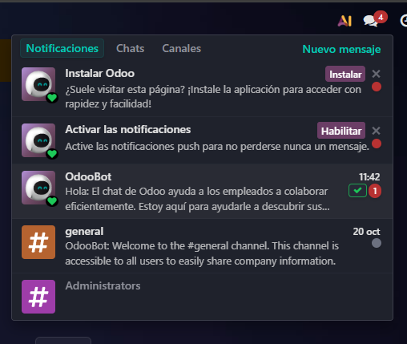
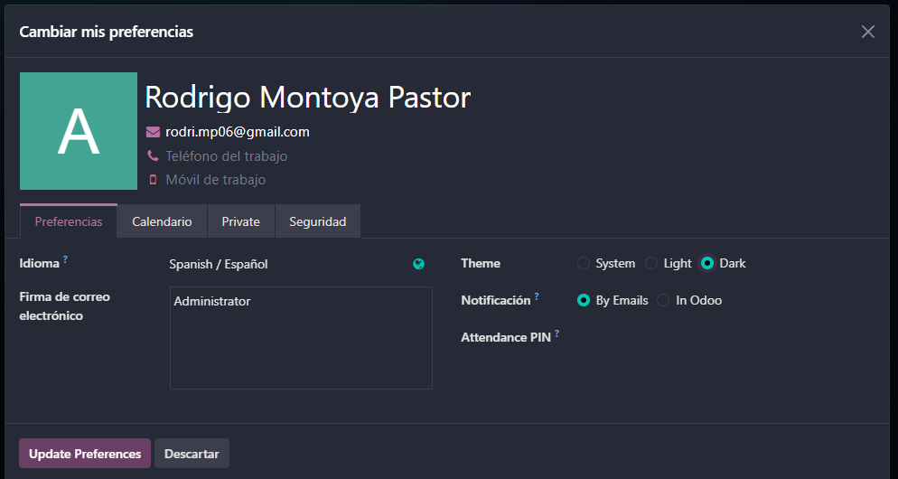
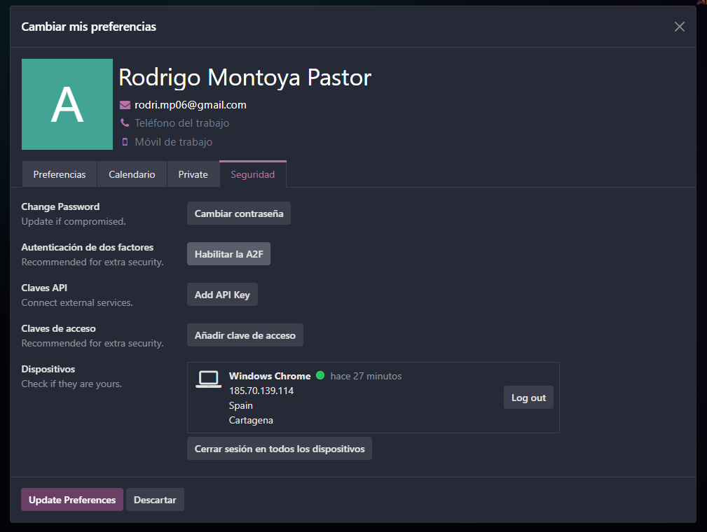

# 04 — Ajustes generales

> Estructura orientativa

Para activar las notificaciones nos iremos arriba a la derecha en la bandeja de texto, nos saldrá una notificación donde podremos habilitar las notificaciones.

Tambnién nos dará la opcion de instalar Odoo para tener una aplicación de escritorio (Muy recomendable para trabajar mas comodamente)

Para ver nuestras preferencias tendremos que hacer click a la foto de nuestro perfil, le daremos a my preferences y se nos abrira esa pantalla.

Dentro podremos cambiar el tema (y activar el modo oscuro), podremos decidir si queremos las notificaciones por Odoo o por email, modificar la firma del email, cambiar el idioma y personalizar nuestra foto de perfil.

Dentro de la misma pantalla nos podremos ir a seguridad y aqui podemos activar la doble autenticación o cambiar la contraseña en caso de que se nos olvide

# DUDAS DE COMO HACERLO Y A QUE SE REFIERE

- **Usuarios y compañías**: roles por módulo; en Enterprise se paga por usuario.
- **Idiomas** y **diseño de documentos** (plantillas de factura).
- **Emails de resumen**: periodicidad y destinatarios.

