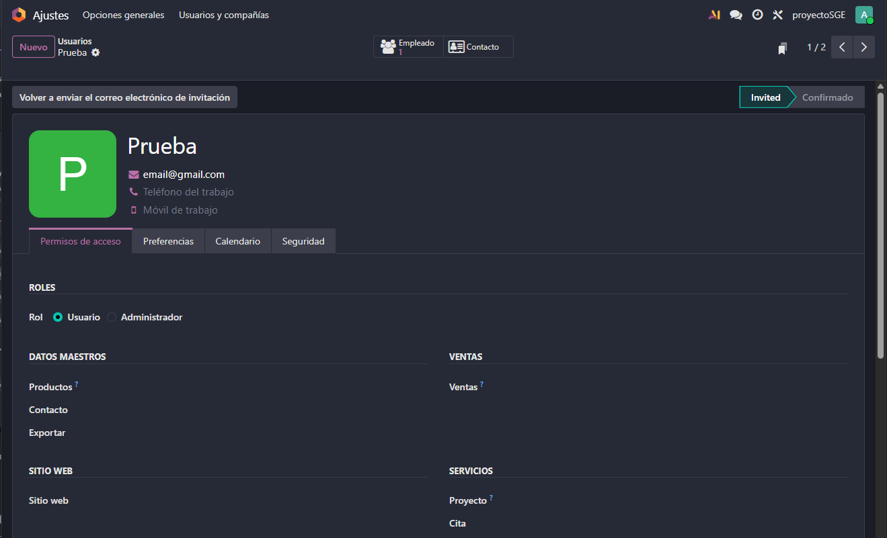
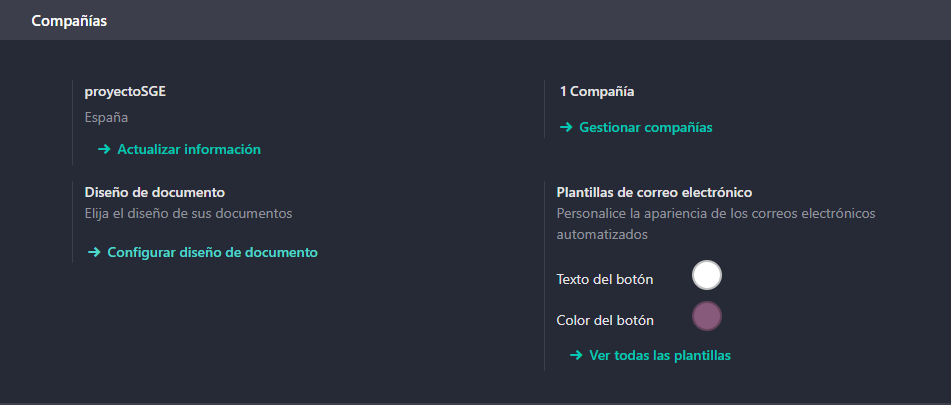
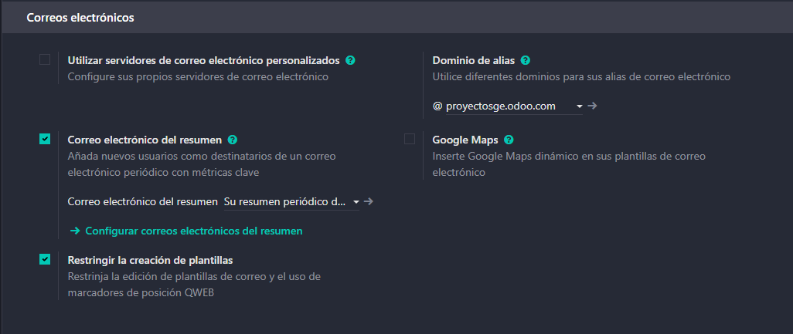
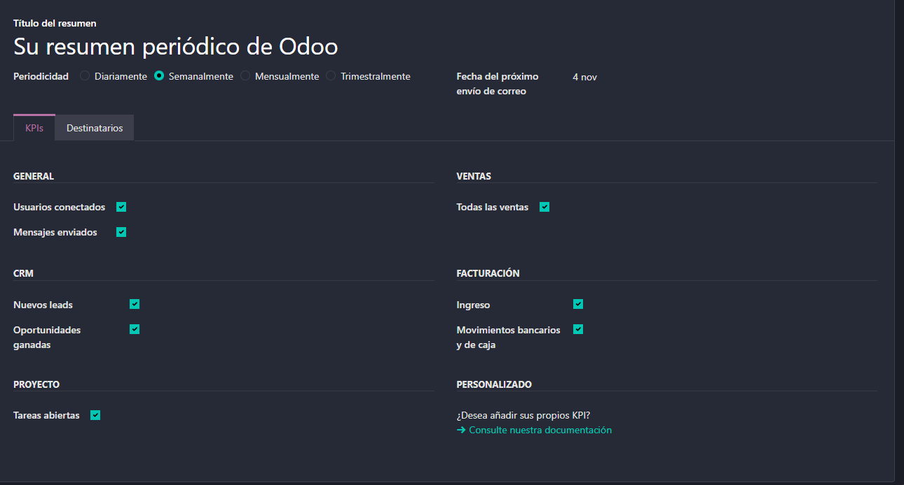

# 04 — Ajustes generales

> Estructura orientativa

Para activar las notificaciones nos iremos arriba a la derecha en la bandeja de texto, nos saldrá una notificación donde podremos habilitar las notificaciones.

Tambnién nos dará la opcion de instalar Odoo para tener una aplicación de escritorio (Muy recomendable para trabajar mas comodamente)

Para ver nuestras preferencias tendremos que hacer click a la foto de nuestro perfil, le daremos a my preferences y se nos abrira esa pantalla.

Dentro podremos cambiar el tema (y activar el modo oscuro), podremos decidir si queremos las notificaciones por Odoo o por email, modificar la firma del email, cambiar el idioma y personalizar nuestra foto de perfil.

Dentro de la misma pantalla nos podremos ir a seguridad y aqui podemos activar la doble autenticación o cambiar la contraseña en caso de que se nos olvide

### Usuarios y compañias

Para poner roles a cada usuario tendremos que seleccionar ajustes desde el panel de aplicaciones, luego le daremos a usuario sy compañias y seleccionamos el usuario al cual queremos modificar.

Dentro de esa pantalla podremos modificar un rol principal (usuario o administrador) y abajo los roles por modulo

### Idiomas y diseño de documentos

En caso de que queramos cambiar el idioma tendremos que irnos a *Mis preferancias* y darle al dibujito del mundo al lado de idioma.

Seleccionamos el idioma y le damos a añadir.

En caso de que se quiera cambiar el diseño del documento (para la factura), habrá que ir a ajustes generales al apartado de compañias.

Aqui podremos cambiar como se ven nuestras facturas.

Para ver el resumen de nuestros correos tendremos que irnos a ajustes al apartado de correos.

Desde aqui podremos hacer los diferentes cambios que queramos. Esto lo que hara servira para ver un resumen periódico de lo que ha ocurrido en la aplicación..
