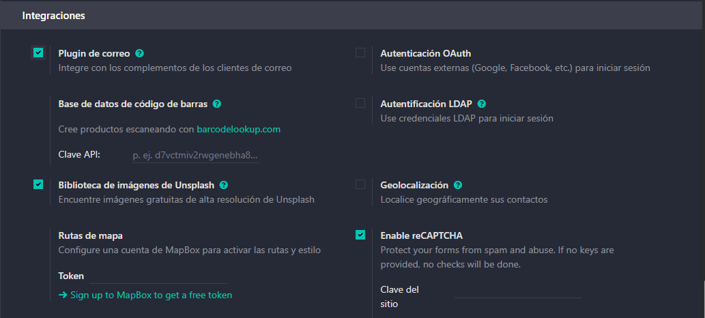

# 05 — Integración con Gmail (OAuth GCP + Add-on)

> Estructura orientativa

## Requisitos

- Cuenta Google Cloud (GCP).

## Pasos resumidos

### Activar plugin de correo

1. **Activar plugin de correo** en Odoo e instalar *Odoo Inbox Add-on* en Gmail.
3. En **Google Cloud Console**: habilitar *Gmail API*, crear **OAuth Client (Web)**, configurar **redirect URI** de Odoo.
4. Copiar **Client ID/Secret** a Odoo (Gmail server settings) y **Guardar**.
5. Probar desde Gmail: crear contacto/oportunidad desde el add-on.

