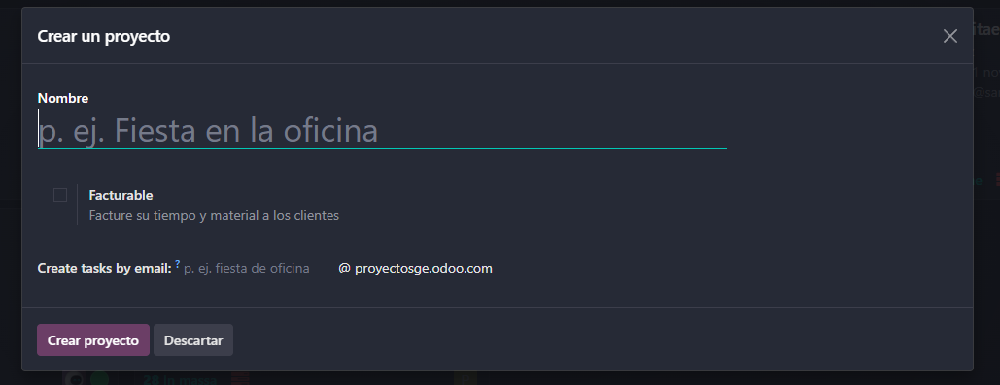
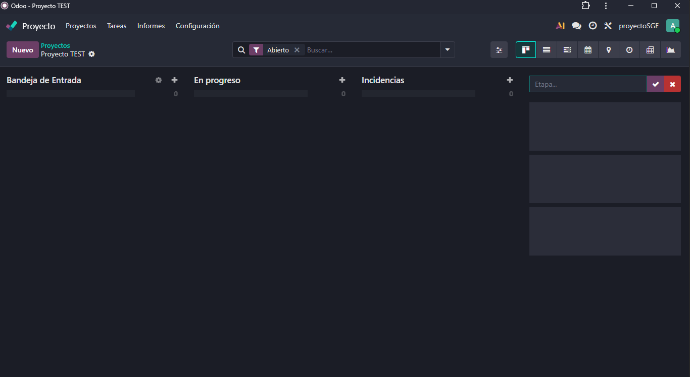
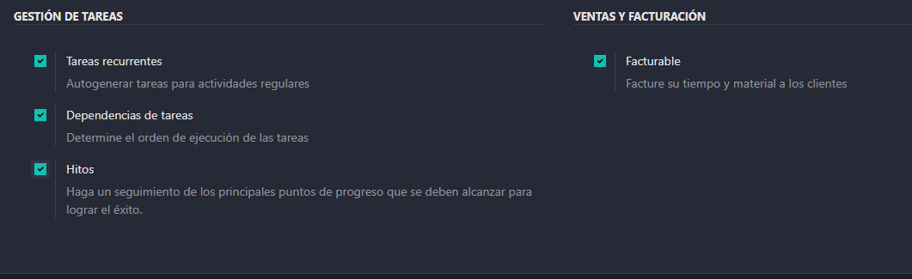
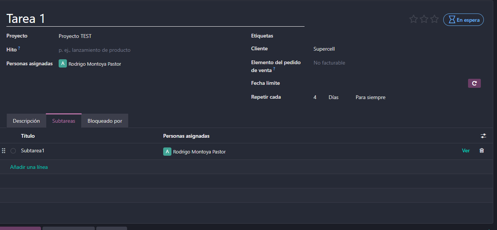

# 08 — Proyectos (Kanban)

### Proyectos, etapas, tareas, **subtareas**.

Para crear un proyecto simplemente nos iremos a su módulo y le daremos a nuevo.

Una vez dentro podremos poner las diferentes etapas en nuestro proyecto de las diferentes tareas que definamos.

Para crear una tarea le daremos al mas que esta al lado del nombre de la etapa y nos saldra el siguiente recuadro donde pondremos el nombre de la tarea y las personas asignadas

Para crear tareas dentro de otras (Subtareas) nos meteremos a la tarea principal y habrá un recuadro donde pondra Subtareas, le damos y añadimos la subtarea que queramos.

### Tareas recurrentes, dependencias, hitos.

Para poder activar todas estas opciones tendremos que estar dentro del módulo de proyectos e irnos a configuración->Proyectos

Una vez dentro activamos las tres opciones que utilizaremos (esto nos servira para que nos aparezcan) y guardamos los cambios.

Cuando hayamos activado esas opciones nos saldrán mas cosas en las tareas por ejemplo.

A la derecha nos aparecera un circulo de *repetición*

- Vistas: tarjetas, lista, calendario propio.
- Registro rápido de actividades y **calificación del cliente**.

