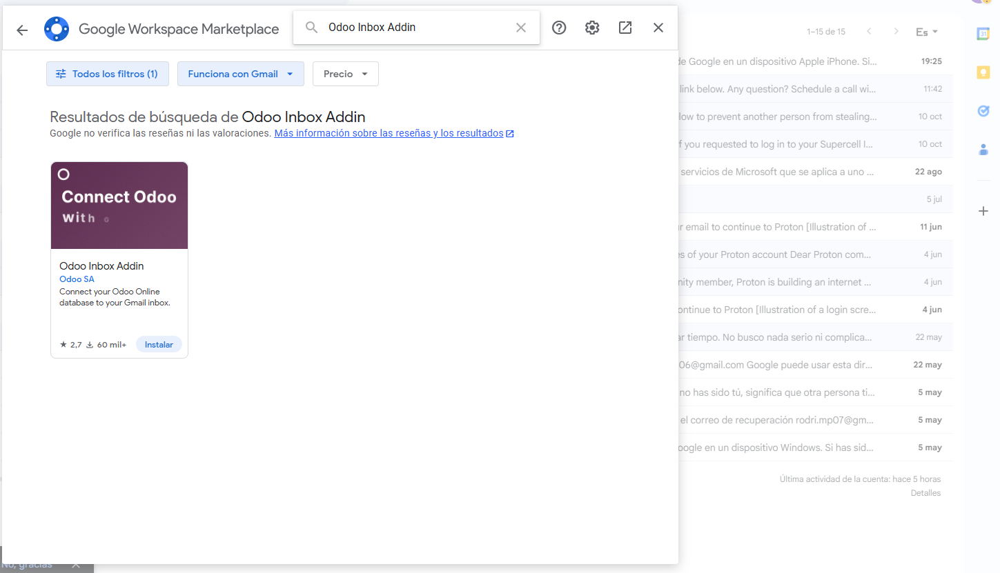
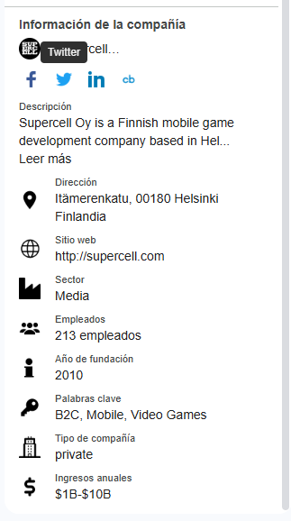
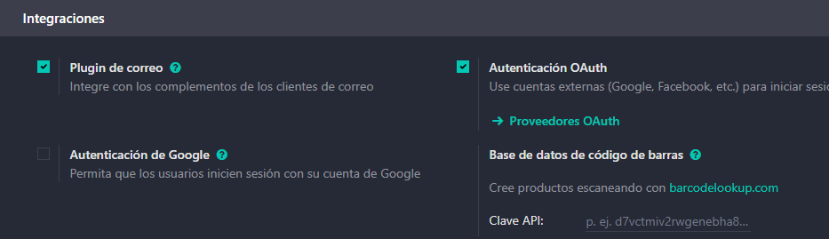
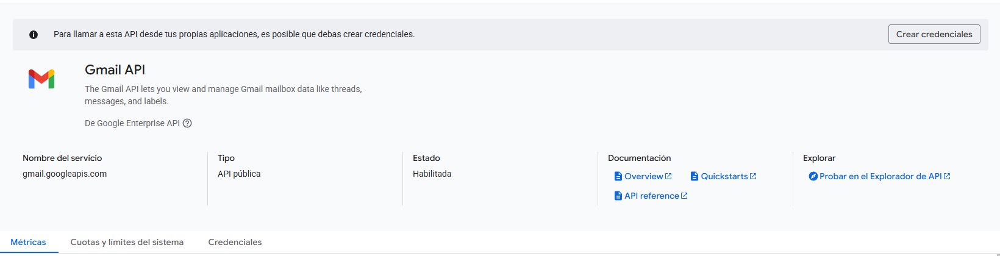
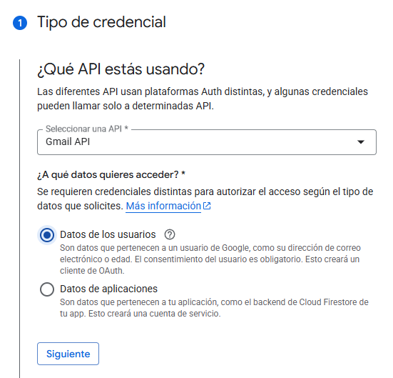
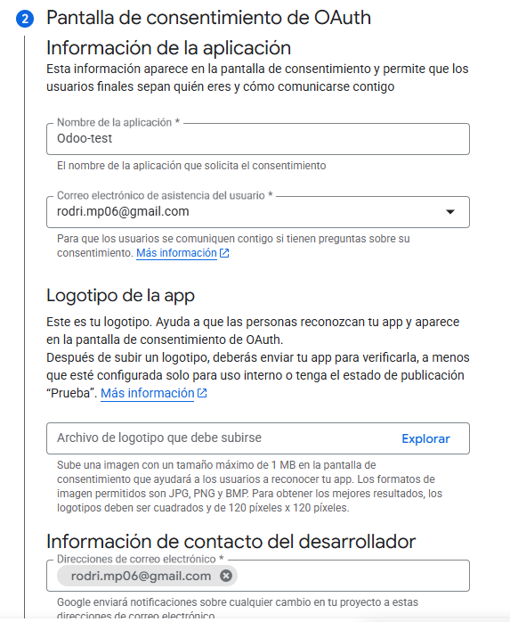
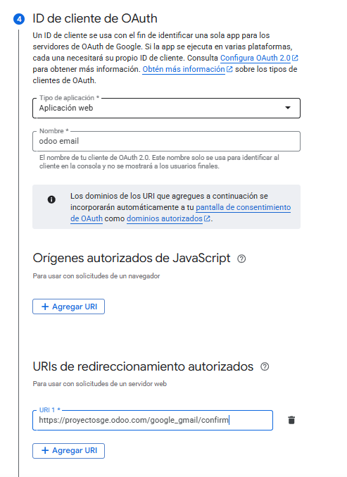
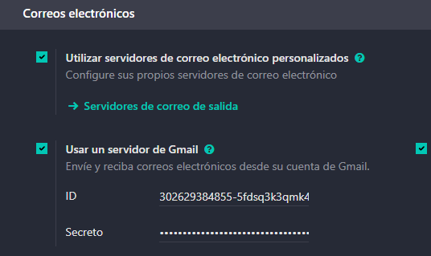

# 05 — Integración con Gmail (OAuth GCP + Add-on)

> Estructura orientativa

## Requisitos

- Cuenta Google Cloud (GCP).

## Pasos resumidos

### Activar plugin de correo

Vamos a ajustes bajamos a integracions y activamos el plugin del correo.

Una vez hecho esto tendremos que ir a email e instalar Odoo Inbox *Add-on* en Gmail.

Para esto le damos al "+" que hay en la barra lateral y buscamos el plugin y lo instalamos

Una vez instalado nos pedira iniciar sesion poniendo la url de la base de datos.

Una vez hecho esto con el plugin del correo activado en Odoo y el plugin de mail instalado, podemos ver la información de la compañía.

Aqui podemos ver la descripcion, ingresos anuales, el sitio web y más.

### 2

Vamos a ajustes bajamos hasta integraciones y activamos la *Autenticación OAuth*

Una vez habilitado tenemos que ir a google cloud para crear un nuevo proyecto

URL: https://console.cloud.google.com/welcome/new?pli=1

Una vez creado seleccionamos el proyecto y el buscador de google cloud buscamos *Gmail API* para habilitarlo.

Cuando lo hayamos habilitado tendremos que crear unas credenciales.

Primero seleccionamos el tipo de API y le daremos permisos de los datos del usuario

Luego rellenamos los datos que nos pidan.

Y en la siguiente pantalla podremos agregar o quitar permisos, le damos y agregamos los permisos que nos interesen

Por último nos pedirá el tipo de aplicación el nombre y añadiremos una URL de redireccionamiento.

La cual será: https//nombre-bbdd-odoo.odoo.com/google_gmail/confirm

Una vez terminado iremos a credenciales seleccionaremos la que acabamos de crear y aqui tendremos tanto el ID secreto como el ID de cliente para añadirlo a Odoo.

Copiamos el ID de cliente y seleccionamos el proovedor de Google para añadir el ID en la siguiente linea.

Por último copiamos de nuevo el ID cliente y el ID secreto y lo pegamos en Correos electrónicos que se encuentra en ajustes

