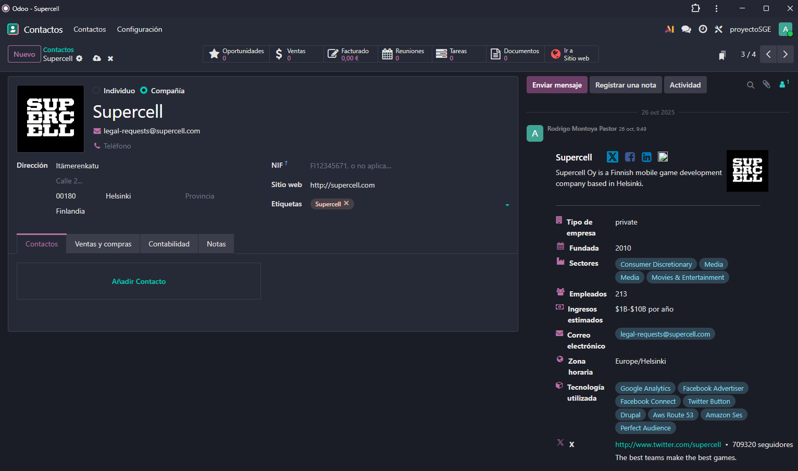
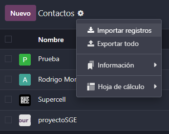
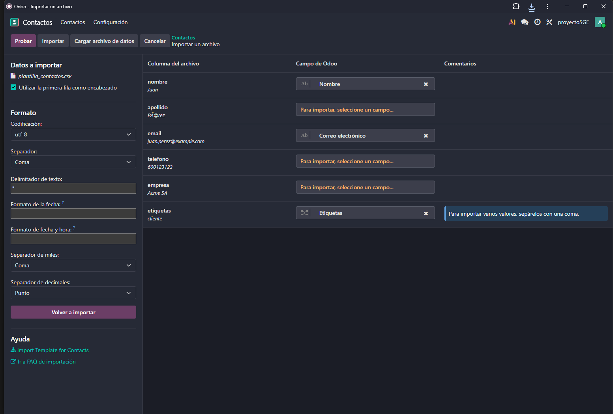

# 06 — Contactos

### Asociación Automática y Etiquetas

Para ver los contactos que tenemos tendremos que meternos en el módulo de contactos (Desde la pantalla princpal).

Este módulo nos indicará los contactos que tengamos asociados en Odoo, hay que tener en cuenta que si hicimos el punto anterior (integración de gmail) se nos guardará los contactos en Odoo de manera automática, como se puede ver con Supercell (compñía de juegos de movil).

Como podemos ver, al meternos a un contacto podremos ver cierta información, esta nos la proporcionará Odoo automaticamente desde cuantos ingresos tienen hasta la tecnología usada, toda esta información se puede encontrar por internet pero Odoo nos la facilita desde este módulo.

También se puede ver el apartado de Etiquetas, esto nos servirá para organizarnos mejor al buscar nuestros contactos (Filtros). En caso de que no esté creada dicha etiqueta nos dará la opción de crearla.

### Exportación e Importación de contactos

En caso de que queramos exportar algún contacto simplemente tendremos que seleccionarlo y darle a acciones->Exportar y se nos facilitará un archivo .csv

Para importar es muy sencillo, simplemente al lado de contactos nos saldra una ruedita desde allí seleccionarmos la opción de importar registros

Seleccionamos el arhivo y nos saldrá la siguiente pantalla.

Desde aquí podemos veer los diferentes tipos de campos y como los organiza Odoo. Si surgue algún error Odoo nos lo indicará.

Una vez terminao le daremos a importar y ya tendríamos el contacto importado.
