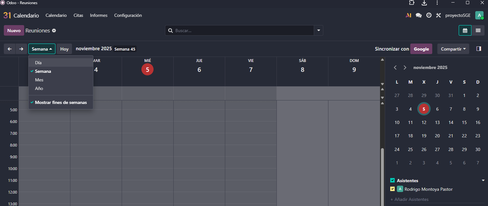
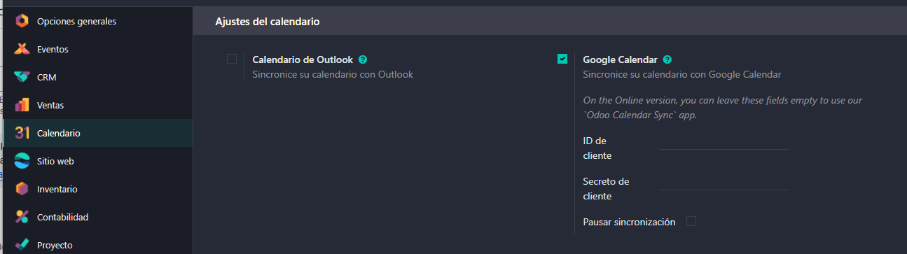
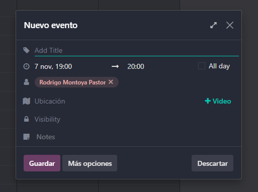

# 07 — Calendario y Citas

### Calendario (día/semana/mes).

Para poder organizarnos Odoo nos proporciona un calendario como otro cualquiera donde lo puedes ver por dias, semana, meses o años

### Integración con Google Calendar** (API OAuth GCP).

Primero tendremos que ir a Google console cloud e instalar la API de Google Calendar (Los mismos pasos para instalar una API que en el apartado de gmail).

La única diferencia es que la URL de direccionamiento será diferente, en este caso será la siguiente:

https://nombre.odoo.com/google_account/authentication

Una vez terminado tendremos que ir a credenciales y copiar el ID de cliente en Ajustes->Calendario y lo mismo con el Secreto de cliente.

Para añadir algun evento simplemente le pincahamos a cualquier parte del calendario y se nos abrirá la siguiente pantalla, le damos a mas opciones para verlo al completo

Desde aqui podemos seleccionar la duracion, la ubicación o incluso poner un enlace a alguna videollamada, ya sea desde google meet o cualquier otra web de videollamadas.
