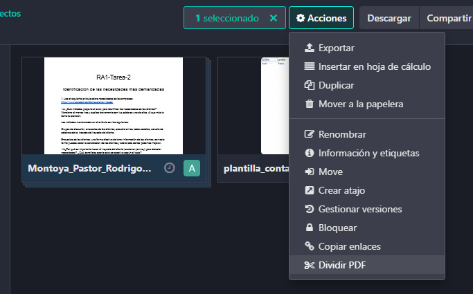
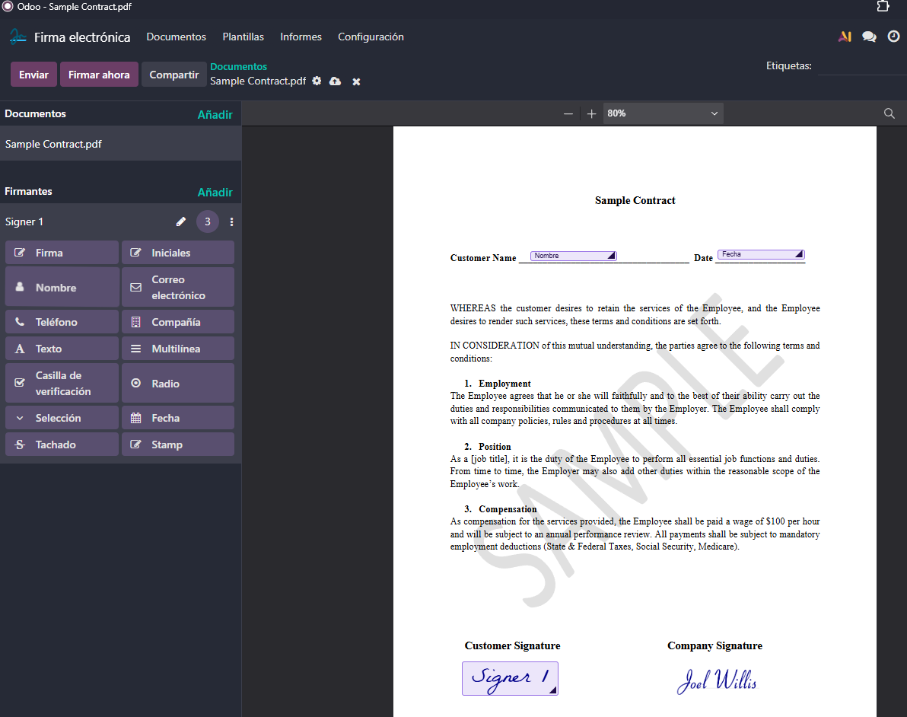
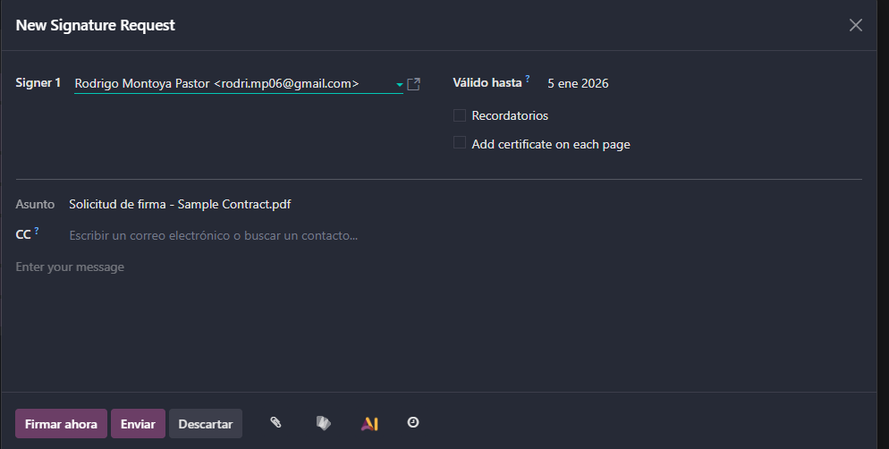
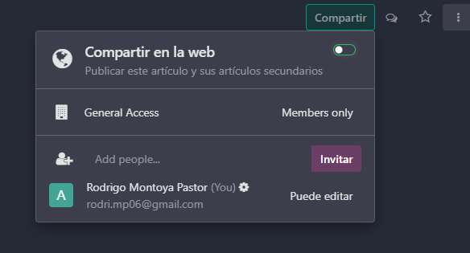

# 09 — Documentos, Firma e Información (Knowledge)

Desde la pantalla principal (pantalla de apps), podremos acceder al módulo de documentos en caso de que no lo tengamos instalado tendremos que irnos a *Aplicaciones* para instalarlo.

Una vez dentro nos aprecera lo siguiente aqui nos apareceran diferentes carpetas pero nos meteremos a la del Proyecto de prueba en mi cas Proyecto TEST.

Una vez dentro del proyecto podremos meter documentos de dos maneras o arrastrando o dandole a *Nuevo* y a subir documento.

Desde el propio módulo podemos dividir las páginas del PDF o editar las hójas del excel

Para dividir los PDFS simplemente seleccionaremos el documento que queramos haciendo ALT+click luego le damos a Acciones->Dividir PDF

Nos saldrá esta pantalla y seleccionaremos las hojas que queramos dividir una vez los seleccionemos le damos a Dividir y ya tendremos dividido el documento en diferentes páginas.

Para modificiar hojas de excel es muy sencillo, simplemente le hacemos click al excel que queramos y ya lo podremos modificar

### Firma electrónica: campos (firma/nombre/fecha), envío y registro.

Para firmar un documento nos iremos al módulo de Firma electrónica. Este es un documento de prueba pero podemos seleccionar el documento que queramos.

Este módulo nos dara diferentes opciones como poner un nombre un número de teléfono y mas, también podemos firmar un documento simplemente vamos y arrastramos la firma hasta donde necesitemos la firma.

Una vez terminado el documento le daremos a enviar y nos saldra la siguiente pantalla  donde nos pedira quien lo firma hasta cuando es válido y un mensaje.

Cuando le demos a firmar ahora tendremos que rellenar los campos que elegimos antreriormente y ya tendremos el contrato firmado y podremos descargarlo.

### **Información (Knowledge)**: wiki tipo Notion, permisos y publicación.

El módulo de Información es una wiki interna que nos servira para centralizar la información de la empresa y compartirla de manera muy sencilla con los empleados.

Este módulo es basicamente un editor de texto donde podremos insertar fotos, documentación, ...

Para crear uno nuevo nos tenemos que ir arriba a la izquierda y darle a *Nuevo articulo*.

Si lo quisieramos compartir Odoo nos da la opcion desde arriba a la derecha (como un documento de google). Al invitar a alguien le podremos poner los permisos que nosotros queramos tanto editor como solo lector, que viene muy bien por cuestiones de seguridad.
