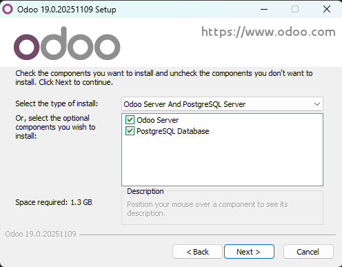
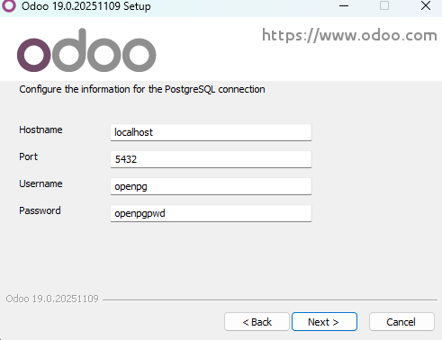

# 04 — PostgreSQL en Windows

> Odoo requiere **PostgreSQL**. Según instalador y versión, se incluye o puede requerir instalación separada.

Para poder tener Odoo es necesario tener PostgreSQL (us sistema de gestión de base de datos).

En el propio instalador nos da la opción de instalarlo en caso de que no lo tengamos.

En la configuración nos pedira un puerto un nombre y contraseña

Tanto el hostname como el puerto lo dejarmeos por defecto, pero el nombre y la contraseña sera el que nosotros queramos (importante acordarse tanto del usuario como de la contraseña para poder tener acceso a la base de datos).
