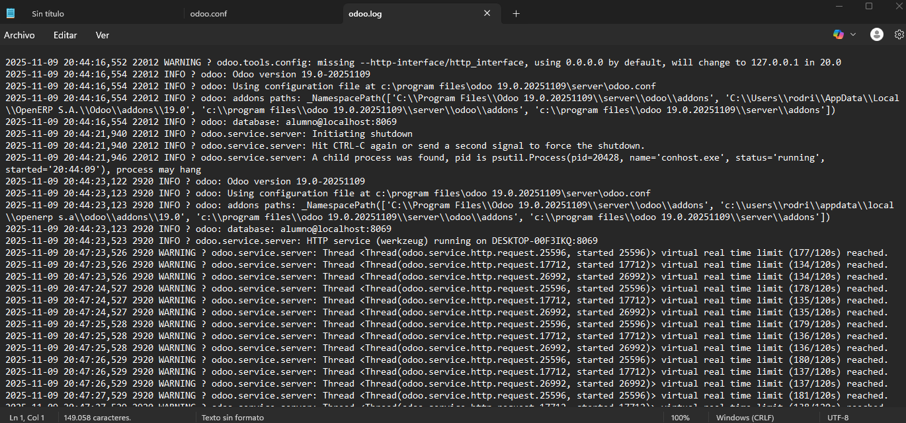

# 07 — Ejecución y servicio

Para poder ejecutar Odoo primero es necesario si el servicio esta activo, para eso tendremos que ir a Servicios de windows.

Tendremos que ver el nombre de `odoo-server-19.0` y ver el estado. En caso de no estar en ejecución tenemos que activarlo nosotros.

Para eso simplemente se le hace click derecho y le damos a iniciar.

En caso de que de error al iniciar siempre podremos ver los logs.

La ruta será la siguiente `C:\Program Files\Odoo 19.0.20251109\server`, y el archivo se llamará `odoo.log`

Aqui podremos ver fecha y hora de las diferentes cosas que vayan pasando
