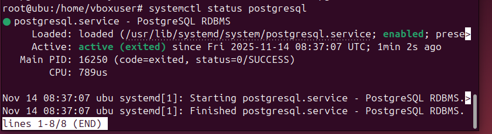

# 04 — PostgreSQL en Linux

1. Instala PostgreSQL desde repos:

``sudo apt install postgresql``
Instalamos la base de datos.

2. Verifica el servicio:

``sudo systemctl status postgresql``

Una vez instalado hay que asegurar de que se ha instalado, con ese comando podemos ver el estado del servicio y con esto se podría comprobar.
