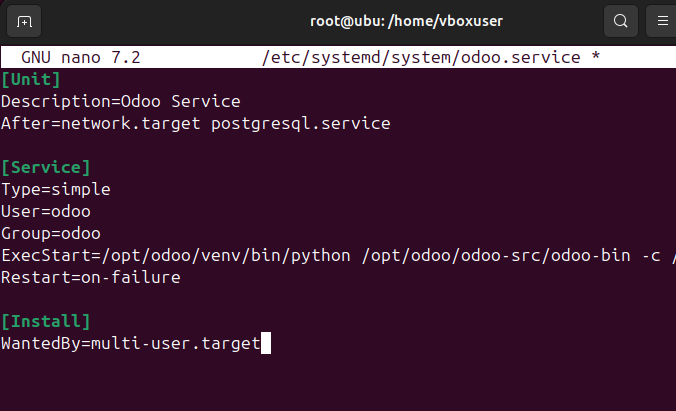
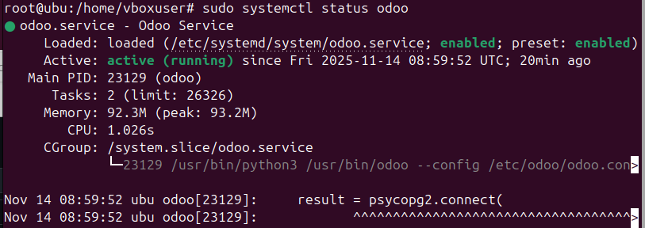

# 08 — Servicio systemd (`odoo.service`)

1. Crea el servicio en `/etc/systemd/system/odoo.service`:
   ```ini
   [Unit]
   Description=Odoo Service
   After=network.target postgresql.service

   [Service]
   Type=simple
   User=odoo
   Group=odoo
   ExecStart=/opt/odoo/venv/bin/python /opt/odoo/odoo-src/odoo-bin -c /etc/odoo/odoo.conf
   Restart=on-failure

   [Install]
   WantedBy=multi-user.target
   ```
   


2. Recarga y arranca:
   Primero es necesario recargarlo para que el systemd pueda leerlo
   ``sudo systemctl daemon-reload``
   Iniciamos Odoo
   ``sudo systemctl enable --now odoo``
   Y miramos si esta activo
   ``sudo systemctl status odoo ``

   

