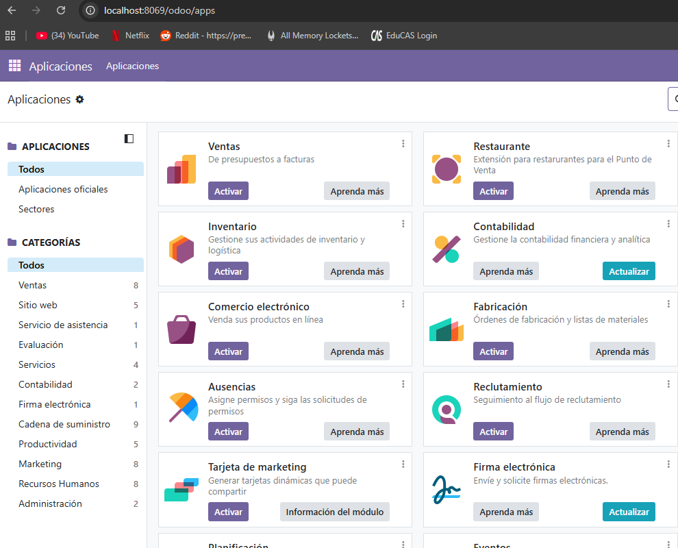

# 09 — Creación de base de datos de prueba

1. Accede a `http://localhost:8069`.
2. Crea una **base de datos nueva** con email/contraseña admin.
3. 
   Una vez hayamos accedido a esa url tendremos que meter los datos que nos pidan para crear una base de datos nueva
   
4. Selecciona módulos iniciales si procede.
5. 
   Una vez creada la base de datos podremos seleccionar los diferentes modulos que queramos.
   

